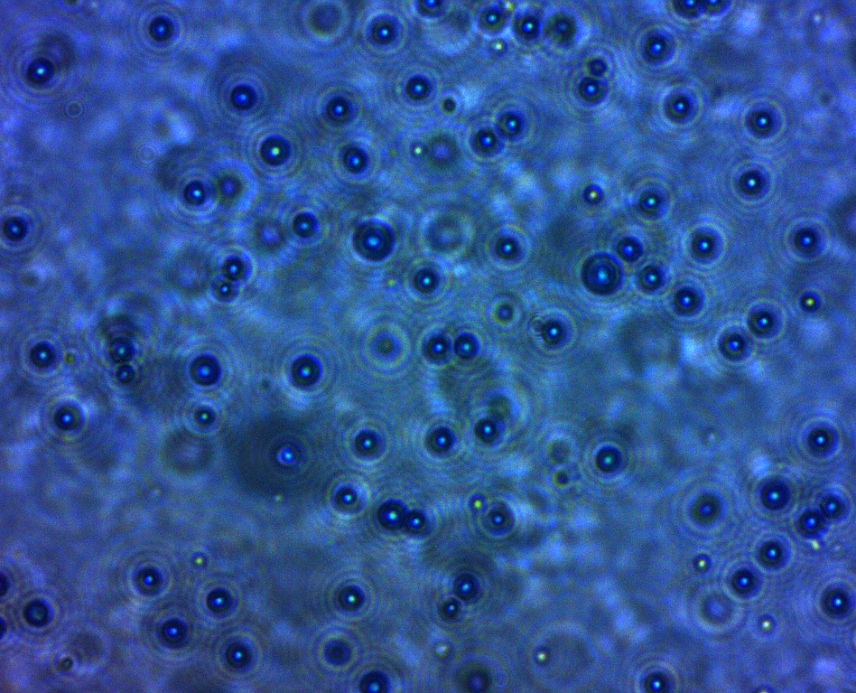

# Análisis de Trayectorias – Movimiento Browniano

## ¿De qué trata este proyecto?

Análisis de datos de trayectorias reales extraídas de videos experimentales. El foco está en limpieza de datos, análisis exploratorio, validación estadística y visualización, trabajando con datos ruidosos similares a los que se encuentran en contextos reales de negocio.

# Preguntas a responder

- ¿Cómo cambia el movimiento de las partículas bajo distintas condiciones?

- ¿Se pueden cuantificar diferencias entre muestras usando datos?

- ¿Los patrones observados son reales o producto del ruido?

# Datos

  
   
  <em>Imagen de una muestra de particulas de latex con una concentracion de 20% de glicerina</em>

- Datos reales de trayectorias extraídas desde videos
- Múltiples muestras bajo distintas condiciones
- Datos crudos con ruido, deriva y valores faltantes

# Flujo de trabajo

- Limpieza y preprocesamiento de datos

- Análisis exploratorio de datos (EDA)

- Definición de métricas y KPIs para comparar muestras

- Aplicación de tests estadísticos para validar supuestos

- Construcción de visualizaciones

# Métricas Clave

- Mean Squared Displacement (MSD): Variabilidad del ensamble

- Coeficiente de difusión: Tasa de cambio del ensamble

- Velocidad de deriva: Tendencia del ensamble

- Indicadores de calidad de datos (ruido, valores faltantes)

- Diferencias estadísticamente significativas entre muestras

# Dashboard

Dashboard interactivo para:

- Comparar métricas entre muestras

- Visualizar tendencias y distribuciones

- Facilitar la interpretación orientada a la toma de decisiones

